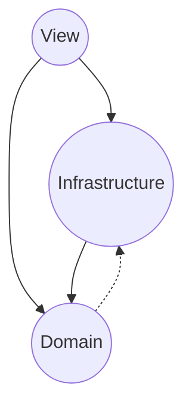

# Architecture

First and foremost, by "architecture" we mean a set of high-level rules and principles that both explains how the codebase is currently structured and how it should evolve over time.

Our architecture is based on a set of modules where each module has a well defined set of responsibilities along with a set of rules regarding which modules may depend on which.

## Modules

### Infrastructure

The infrastructure module is responsible for mediating the communication between the application and anything that's external to it (mostly HTTP APIs as we're in the frontend).

It houses:

- HTTP Client -> A thin abstraction for making HTTP requests
- APIs "SDKs" -> A 1-1 mapping between endpoints and functions that call these endpoints
- APIs Representations/Models -> APIs usually have an internal model of the domain, a way they see and represent it
- Infra <-> Domain Mappers -> Translations between Infra <-> Domain representations/models

The APIs SDKs are also responsible for making sure that the data they get back from APIs conform to the established contracts through validation (and reporting when deviations are found) and for retrylogic when applicable.

Although validating data that is returned by the API might seem like an overkill, in **all** the projects I worked on, there **always** comes a time when frontend breaks due to some bad data that is returned by APIs and then we have to account for it with some fallback + logging. This also guarantees that our types are not "lying", in the sense that because we validate the data right at the source, it's safe to assume that whatever our types say about that data, it is correct.

Additionally, even though we are using TanStack Query (which already provides built-in retry logic), we should keep retry logic within the APIs SDKs, because as they represent the API itself inside our application, it's them who know **which endpoints can be retried** (only idempotent requests can be retried), **how many times**, **which delay logic to use**.

Aside from the cross-cutting concerns modules (config, logging, etc), the only other module the infrastructure can depend on is the domain.

### Domain

The domain module is responsible for segregating the application's core logic and models from the rest of the application, keeping it pure.

It houses:

- Domain Representations
- Domain Logic

Domain representations are the representations for domain concepts that make sense from **our application's** perspective and are malleable/flexible, as more often than not, the representations that APIs use are cumbersome to deal with and do not really make much sense from our application's perspective.

Because we're in the frontend, for most cases the source of truth will reside on the backend, and thus, our domain representations will be a distilled version of the backend ones.

This "distillation" process is carried by the **mappers** on the infrastructure module, and with this process we can do things like:

- Omitting fields that we won't use, to declutter representations
- Renaming fields so that we can keep our representations consistent with our model (and other niceties like converting from `snake_case` to `camelCase`)
- Simplifying the structure (e.g. backend returns a deeply nested structure with arrays within arrays)

Aside from the cross-cutting concerns modules, the domain module can only depend on the infrastructure module and nothing else, however, because it is at the core of our application, every other module can depend on it.

There's a very important note about the domain depending on the infrastructure:

Canonically, the domain should not depend on anything else, much less the infrastructure, however, to make that possible, what's done is that for domain logic whose control flow has to go from domain -> infrastructure, we establish that the interface for the services that implement that logic belongs to the **domain** while the **implementation** belongs to the infrastructure.

Although this is more "tecnically" correct, I've realized that in practice this causes much more confusion than it's worth, so, to remediate that, we'll bend the usual notion a little bit, where instead of having to jump through these conceptual hoops, we'll allow the domain to call the infrastructure directly, **but with a catch**:

Although domain services are allowed to depend on the infrastructure directly, **they must never let that bleed out through their interfaces**, that is, if a `fetchUser` function internally calls the API SDK in its implementation, whoever **calls** it, should not know that, as the parameters and the return of `fetchUser` **must only use domain representations**.

### View

The View module is responsible for the UX/UI of the application, like rendering the UI, receiving user input and translating it to actions that will be delegated to the domain and infrastructure modules.

It houses:

- React Components
- React Hooks
- CSS
- UI Formatting Logic -> Domain <-> View translations
- I18N
- Analytics

This is the **only** module that knows React exists, all the other modules should remain ignorant of it.

Additionally, this module **must not** implement domain/infrastructure logic itself, but rather delegate to these modules whenever such logic is necessary.

This view module may depend on any other modules, but must not be depended by other modules.

### Config

The config module is a cross-cutting concern module that deals with application configuration like environment variables, feature flags, etc.

As a cross-cutting concern module, it may depend and be depended by any other module.

### Logging

The logging module is a cross-cutting concern module that handles logging/monitoring.

As a cross-cutting concern, it may depend and be depended by any other module.

## Dependency Graph

Here's a dependency graph which depicts which modules may depend on which.

Cross-cutting concern modules are hidden as they may depend and be depended by any other module.



## Folder Structure

```txt
.
└── src/
    ├── config/ -> Config module
    ├── domain/ -> Domain module
    │   ├── domainConcept1/
    │   └── domainConcept2/
    ├── infrastructure/
    │   ├── specificApi/
    │   │   ├── endpoints/
    │   │   ├── mappers/ -> Infra <-> Domain mappers
    │   │   └── models/
    │   └── specificApiHttpClient.ts
    ├── logging/
    ├── mock/
    ├── utils/
    └── view/
        ├── viewConcept1/
        └── viewConcept2/
```
