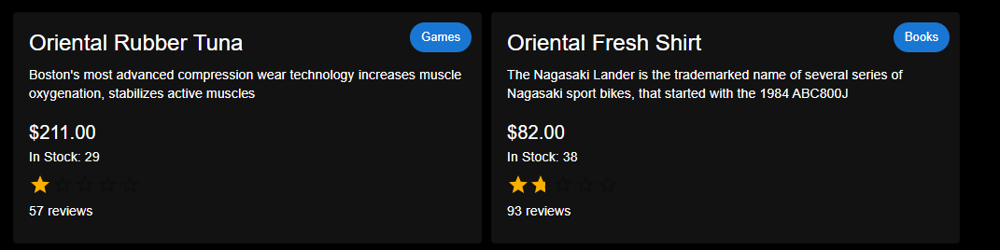

# Frontend Documentation

## Overview

This documentation outlines the capabilities and changes made to the frontend, focusing on the products listing page and the product detail single page.

---

## Products Listing Page

### Displaying All Products from Mock Data

We have implemented a feature that enables the display of all products available in our mock data. Users can now easily browse through the entire product catalog, providing them with a comprehensive view of our offerings.

### Pagination for Improved Navigation

To enhance user experience and prevent issues associated with infinite scrolling, we have introduced pagination functionality. Users can now navigate through the product list more efficiently by moving between different pages, allowing for smoother and more organized browsing.

### FiltersSidebar for Enhanced Search

To further improve product discovery, we have added a **FiltersSidebar** that allows users to filter products by various criteria:

- **Rating:** Users can filter products based on their average ratings.
- **Price Range:** Users can set a price range to view products that fit their budget.
- **Category:** Users can select specific categories to narrow down the displayed products.

### Components Involved

- **ProductsList:** Responsible for rendering the list of products with pagination and filters applied.
- **FiltersSidebar:** Contains the filtering options for users to refine their search.

---

## Products Detail Single Page

### Single Page Description for Products

We have introduced a feature that offers detailed product descriptions on a single page. Users can now access comprehensive information about each product, including specifications, pricing, and additional details, all in one centralized location. This enhancement aims to provide users with a better understanding of our products, facilitating informed decision-making during their shopping experience.

### Components Involved

- **ProductDetail:** Displays detailed information about the selected product, including a full description, price, specifications, and user reviews.

---

## Folder Structure

- `app/products/layout.tsx - Product page layout`
- `app/products/page.tsx - Main Products Page displaying the product list`
- `app/products/[productId]/page.tsx - Page for the single product description`
- `src/mock/small/products-new.json - Mock JSON for the small product list`
- `src/mock/large/products-new.json - Mock JSON for the large product list`
- `src/components/ui/ProductCard/index.tsx - Product Card component`
- `src/components/ui/FiltersSidebar/index.tsx - Filters Sidebar component`
- `src/components/ui/Pagination/index.tsx - Pagination component`
- `src/components/ui/ProductList/index.tsx - Products List component`

---

## Components

### Product Card

The **Product Card** component is designed to display individual product details in a visually appealing and organized manner. This component enhances the user experience by providing key information about each product in a concise format.



#### File Location

- `src/components/ui/ProductCard/index.tsx`

#### Usage

To use the Product Card component, import it into your desired file and pass the product object as a prop.

```tsx
import ProductCard from '@/src/components/ui/ProductCard';

<ProductCard product={product} />;
```

#### Props

The **Product Card** component accepts the following prop:

| Prop Name | Type      | Description                                                                                                                                  |
| --------- | --------- | -------------------------------------------------------------------------------------------------------------------------------------------- |
| `product` | `Product` | An object containing the details of the product to display. It should conform to the `Product` type defined in `src/type/products/index.ts`. |

#### Product Type Structure

The `Product` type includes the following properties:

| Property       | Type     | Description                                  |
| -------------- | -------- | -------------------------------------------- |
| `id`           | `string` | The unique identifier for the product.       |
| `name`         | `string` | The name of the product.                     |
| `price`        | `string` | The price of the product.                    |
| `description`  | `string` | A brief description of the product.          |
| `category`     | `string` | The category to which the product belongs.   |
| `rating`       | `number` | The product's average rating (from 0 to 5).  |
| `numReviews`   | `number` | The total number of reviews for the product. |
| `countInStock` | `number` | The number of items available in stock.      |

#### Component Structure

The **Product Card** component is structured as follows:

- **Material-UI Components**:
  - `Card`: The main container for the product details.
  - `CardContent`: Holds the content of the card.
  - `Typography`: Used for displaying text elements (name, description, price, etc.).
  - `Chip`: Displays the product category.
  - `Rating`: Displays the product rating visually.

#### Example

Here's a complete example of how to implement the **Product Card**:

```tsx
import React from 'react';
import ProductCard from '@/src/components/ui/ProductCard';

const product = {
  id: '1',
  name: 'Sample Product',
  price: '49.99',
  description: 'This is a sample product description.',
  category: 'Electronics',
  rating: 4.5,
  numReviews: 100,
  countInStock: 20,
};

const ExampleComponent = () => {
  return (
    <div>
      <ProductCard product={product} />
    </div>
  );
};

export default ExampleComponent;
```

#### Visual Design

Refer to Storybook for detailed visuals and interactive examples.

### FiltersSidebar

The **FiltersSidebar** component provides users with options to refine their search based on rating, price range, and categories. This component enhances the user experience by allowing more targeted browsing of products.

#### File Location

- `src/components/ui/FiltersSidebar/index.tsx`

#### Usage

To use the FiltersSidebar component, import it into your desired file and pass the relevant props.

```tsx
import FiltersSidebar from '@/src/components/ui/FiltersSidebar';

<FiltersSidebar
  ratingFilter={ratingFilter}
  setRatingFilter={setRatingFilter}
  priceRange={priceRange}
  setPriceRange={setPriceRange}
  categoryFilter={categoryFilter}
  setCategoryFilter={setCategoryFilter}
  categories={categories}
/>;
```

#### Props

The **FiltersSidebar** component accepts the following props:

| Prop Name           | Type                                                                 | Description                                          |
| ------------------- | -------------------------------------------------------------------- | ---------------------------------------------------- |
| `ratingFilter`      | `number`                                                             | The current rating filter value.                     |
| `setRatingFilter`   | `React.Dispatch<React.SetStateAction<number>>`                       | Function to update the rating filter value.          |
| `priceRange`        | {`min: number; max: number;`}                                        | The current price range with min and max values.     |
| `setPriceRange`     | `React.Dispatch<React.SetStateAction<{ min: number; max: number }>>` | Function to update the price range.                  |
| `categoryFilter`    | `string`                                                             | The current category filter value.                   |
| `setCategoryFilter` | `React.Dispatch<React.SetStateAction<string>>`                       | Function to update the category filter value.        |
| `categories`        | `string[]`                                                           | An array of available categories to filter products. |

#### Example

Here's a complete example of how to implement the **FiltersSidebar**:

```tsx
import React from 'react';
import FiltersSidebar from '@/src/components/ui/FiltersSidebar';

const ExampleComponent = () => {
  const [ratingFilter, setRatingFilter] = useState(0);
  const [priceRange, setPriceRange] = useState({ min: 0, max: 1000 });
  const [categoryFilter, setCategoryFilter] = useState('');
  const categories = ['Electronics', 'Books', 'Clothing'];

  return (
    <FiltersSidebar
      ratingFilter={ratingFilter}
      setRatingFilter={setRatingFilter}
      priceRange={priceRange}
      setPriceRange={setPriceRange}
      categoryFilter={categoryFilter}
      setCategoryFilter={setCategoryFilter}
      categories={categories}
    />
  );
};

export default ExampleComponent;
```

#### Visual Design

Refer to Storybook for detailed visuals and interactive examples.

### Pagination

The **Pagination** component provides a user-friendly way to navigate between different pages of products. It displays the current page and total pages, along with buttons to move to the next or previous page.

#### File Location

- `src/components/ui/Pagination/index.tsx`

#### Usage

To use the Pagination component, import it into your desired file and pass the relevant props.

```tsx
import Pagination from '@/src/components/ui/Pagination';

<Pagination currentPage={currentPage} totalPages={totalPages} onNext={nextPage} onPrev={prevPage} />;
```

#### Props

The **Pagination** component accepts the following props:

| Prop Name     | Type         | Description                              |
| ------------- | ------------ | ---------------------------------------- |
| `currentPage` | `number`     | The current active page number.          |
| `totalPages`  | `number`     | The total number of pages available.     |
| `onNext`      | `() => void` | Function to handle next page action.     |
| `onPrev`      | `() => void` | Function to handle previous page action. |

#### Example

Here's a complete example of how to implement the **Pagination**:

```tsx
import React from 'react';
import Pagination from '@/src/components/ui/Pagination';

const ExampleComponent = () => {
  const currentPage = 1; // Example current page
  const totalPages = 10; // Example total pages

  const nextPage = () => {
    // Handle next page logic
  };

  const prevPage = () => {
    // Handle previous page logic
  };

  return <Pagination currentPage={currentPage} totalPages={totalPages} onNext={nextPage} onPrev={prevPage} />;
};

export default ExampleComponent;
```

#### Visual Design

Refer to Storybook for detailed visuals and interactive examples.

---
