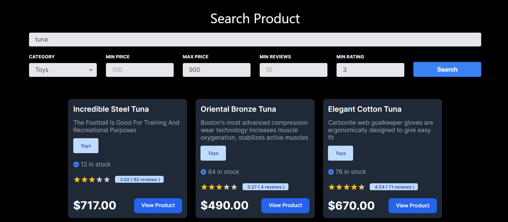

# Product Search Page

I have built a product search page. Which has following features:

- Dynamic search, results will appear as the user types
- Product filters for the relevant metadata
- Product Cards
- Product Search API endpoint

Here are the details:

## Dynamic Search

Dynamic search allows user to search dynamically. Users can see the product results while typing the query. This feature works like an autocomplete feature.

To avoid extra load on the server, I have put a condition to send the request to API after user types atleast 3 letters. Alternatively, debouncing can also be used.

## Product Filters

Currently, there are 5 filter for the user to apply on the search results. Those are Filter by Category, Min Price, Max Price, Min Reviews, and Min Rating.

Any of the filters can be applied to update the search results dynamically.

## Product Cards

A new product card component is created to enhance the look of the search results. The product metadata is highlighted with UI components for user friendly representation.

A new rating component is used to show the ratings in the form of stars. The actual rating along with the number of reviews are highlighted in a tag.

The category is highlighted with a tag.

The price is added to the bottom with a new button component for better user engagement.

## Product Search API

A new API is created to handle user search query requests. Instead of loading the mock data on every request to the frontend, I have created an API to serve only what is requested.

The API sends only 15 results to not overload the network payload. Pagination feature is introduced to navigate easily for the requested data.

## Future Enhancements

More functionalities can be implemented on the backend as well as on the frontend to optimize the solution even more which was not possible due to time constraint.

Code splitting / lazy loading can be implemented.

The frontend can be modularized further by offloading the utility functions and filter components.

Caching mechanism can be improved. ( https://nextjs.org/docs/app/building-your-application/caching )
