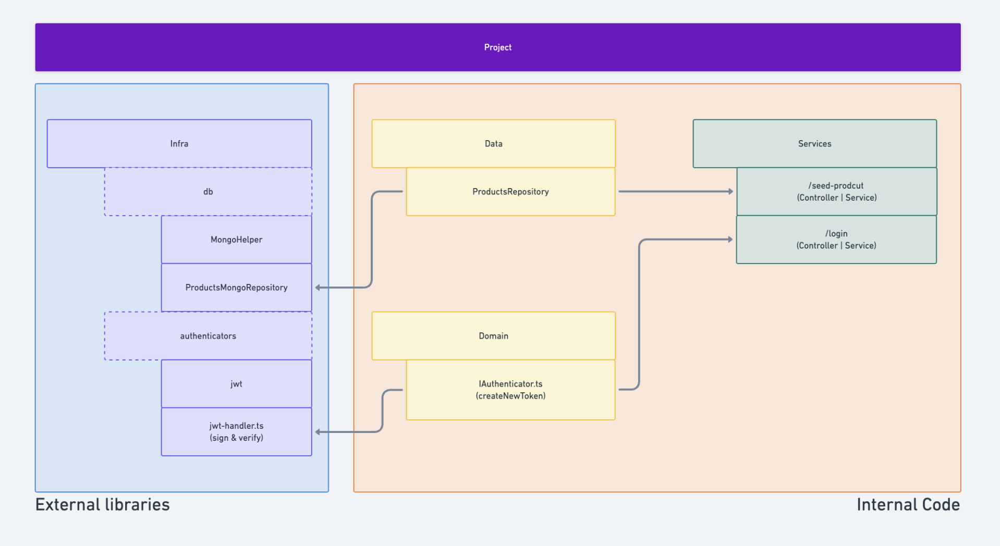

# Infrastructure

## How Infrastructure Connects to API

For better software quality and to prevent outside libraries from affecting the source logic, all the libraries below (such as JOI, JWT, etc.) are not directly connected with services. I opted to ALWAYS implement interfaces, and infrastructure tools should adapt to what we need.

This way, we can ensure that our source code is clean and safe from future changes in tools, if necessary.

## Used tools guide

### 1- [Docker](./docker/docker-instructions.md)

### 2- [Database](./database/database-instructions.md)

### Smaller implementations

- Implemented file [changelog](../../changelog.md) to save all changes and issues solved
- Validators
  - Implemented [JOI](https://www.npmjs.com/package/joi) for input validation
- Authenticators
  - Implemented [BCRYPTJS](https://www.npmjs.com/package/bcryptjs) for password hash
  - Implemented [JWT](https://jwt.io/introduction) for token management
